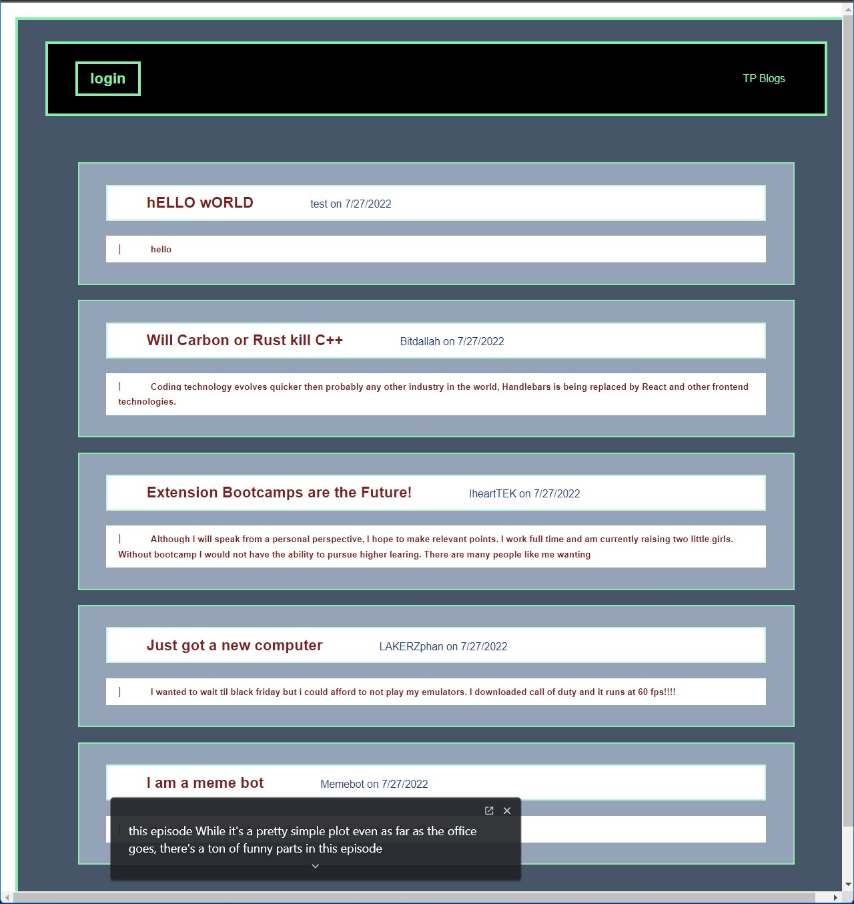

# Tek Place, inc

  

  ## Description
  There is no place like a public internet forum to read about the latest news or comment on blogs.  
  This application allows you to create a username and once logged in, you can write blogs and comment on others.
  Jump in! the water is fine, the conversation is ready.

  ## Table of Contents
  - [Description](#description)
  - [Installation](#installation)
  - [Usage](#usage)
  - [License](#license)
  - [Contribution](#contribution)
  - [Test](#test)
  - [questions](#questions)
  - [Github](#github)
  - [Email](#email)
  
  ## Installation
  Clone git repository, type in terminal "npm i" to install node-modules
  type in terminal "npm start" to run

  ## Usage
  type in terminal "npm start" to run and localhost
  chose a username and password from seeds or create your own.

  ## License
    This program is licensed by MIT.

  ## Contribution
  none

  ## Test
  
  ## Questions
  Feel free to reach out GitHub or email if you have any questions
  
  ## GitHub URL
  Github: https://github.com/SalvadorBanuelos424
  
  ## Email
  Sbanuelos1234@gmail.com
  
  Made with ❤️ by Salvador Banuelos
### © 2022 Tek Place, Inc.